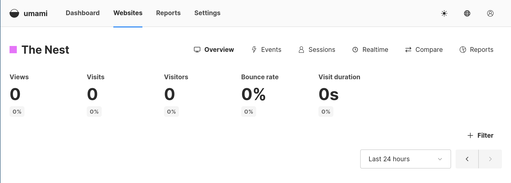
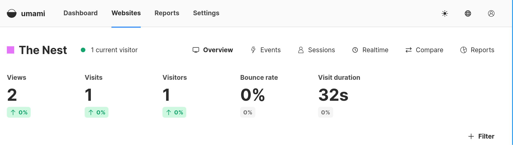

+++
title = "Privacy Centric Analytics"
date = "2025-02-15T23:58:00-05:00"
#dateFormat = "2006-01-02" # This value can be configured for per-post date formatting
author = "Crow"
authorTwitter = "" #do not include @
cover = ""
tags = ["nix", "selfhosting"]
description = ""
showFullContent = false
draft = false
+++

A thing I was interested in was how I could do some tracking about who is
visiting this site without hooking into the ugly beast that is Google Analytics.
This led me to find [umami](https://github.com/umami-software/umami), which
claims to be "a simple, fast, privacy-focused alternative to Google Analytics".
Looking further at their documentation we can see that it's GDPR compliant
(doesn't collect any PII) and is cookieless, meaning we don't need an annoying
banner popup. Seems pretty sweet!

There's a docker compose in here that we can translate to nix.

```nix
virtualisation.oci-containers = {
  backend = "podman";
  containers = {
    "umami" = {
      image = "ghcr.io/umami-software/umami:postgresql-latest";
      dependsOn = ["umami-db"];
      extraOptions = ["--ip=10.88.0.6"];
      environmentFiles = [config.sops.templates."umami-env".path];
    };
    "umami-db" = {
      image = "postgres:15-alpine";
      volumes = ["${volumePath}/umami:/var/lib/postgresql/data"];
      extraOptions = ["--ip=10.88.0.7"];
      environmentFiles = [config.sops.templates."umami-db".path];
    };
  };
};
```

Now we need some sort of app secret, I manage all my deployment secrets in SOPS
which probably deserves its own post entirely, just know we can generate one
pretty easily with `head -c 32 /dev/urandom | base64`. With that secret
generated we can make a template to use as the environment file for the
container.

With our expression complete we can spin everything up and login to our umami
dashboard and add a website. After we create that we can get a tracking code
that needs to be placed in the head of all our html files. This is pretty simple
in hugo, according to the readme for this theme, we just need to create a
directory at `layouts/partials/extended_head.html`

Here's a quick before and after shot, showing off the tracking stats and the
clean interface.



